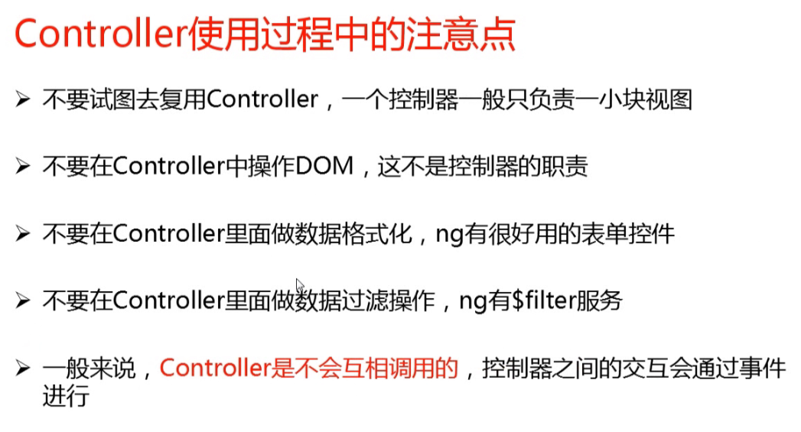
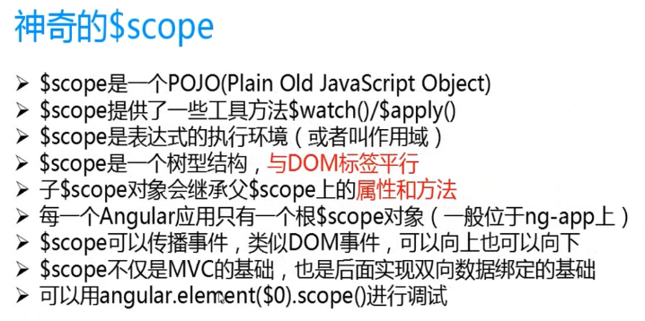
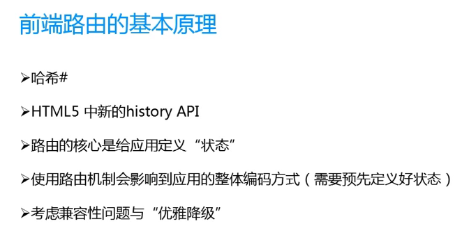
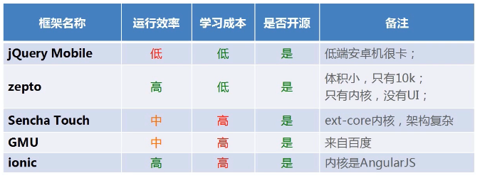

# Angular

## 4大核心特性
* MVC
* 模块化
* 指令系统
* 双向数据绑定

## 注意
* 不支持IE8
* 
* 
* 

## 开发
* 编辑器 - Sublime、Webstorm
* 断点调试工具 - Angular Batarang(Chorme)
* git图形界面 - 小乌龟
* 服务器 - http-server(NPM)
* 编写测试用例 - jasmine(分组、用例、期望、匹配)
* 单元测试工具 - karma
* 模拟鼠标测试 - Protractor(Angular)

## 其他
* MVC只是手段，终极目标是模块化和复用
* 闪屏(加载数据之前有花括号等等标记)可以使用ng-bind去显示数据

## angular模块注入
* 内联式
* 推断式
* 声明式

## 移动端
* Native APP
* WEB APP(H5+C3+JavaScript、打包工具)
    1. [Phonegap](http://www.phonegap.com ".ipa")
    2. [APPcan](http://www.appcan.cn/ ".apk")
    3. [APPcelerator](http://www.appcelerator.com ".xap")
    4. 设计开发打包一体化工具：Inter XDK(需要项目开源)
* Hybrid APP
* 
