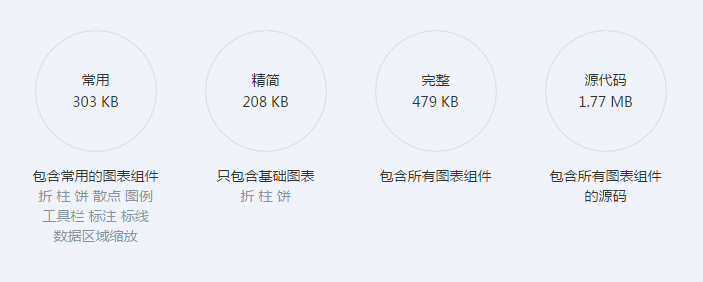

## Charts
**各类JavaScript图形图表的插件(框架)**

#### D3
* Nice
    1. 优雅漂亮，图形图表齐全
    2. 轻量级：核心336k，压缩后151k
    3. 灵活度高
    4. 社区活跃
* Low
    1. 学习难度高
    2. 不支持IE6、7、8，而IE9支持不完整
    3. 不易管理
    4. 不能导出图片
* [点我](http://c3js.org/)

#### HighCharts
* Nice
    1. 兼容所有浏览器
    2. 轻量级：压缩后172k
* Low
    1. 开源并非商业免费，但价格nice
    2. 图形图表种类较少
    3. 社区扶助有限
* [点我](http://www.highcharts.com/)

#### ECharts
* Nice
    1. 优雅漂亮，图形图表齐全
    2. 兼容大部分主流浏览器(包括IE6+)
    3. 学习难度低，示例多
    4. 有生成图片等额外功能
* Low
    1. 不轻：压缩后470k，主要300k，基本204k
* [点我](http://echarts.baidu.com/)
* 
